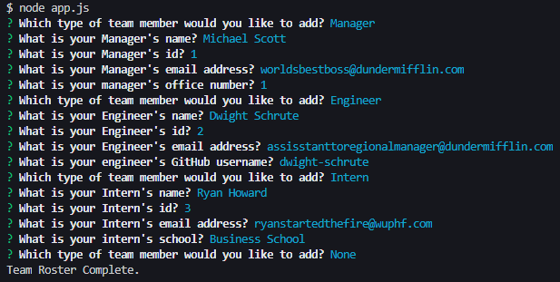
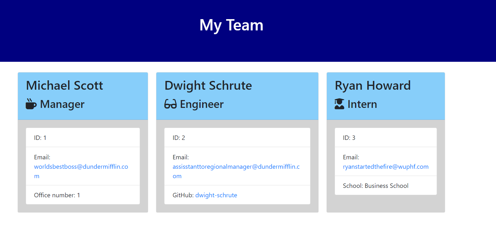

# Team-Generator

## Table of Contents
* [Description](#Description)
* [Links](#Links)
* [Design Elements](#Design-Elements)
* [App Preview](#App-Preview)
* [Credits](#Credits)

## Description
This is a command-line application that generates a software engineering team displayed on an HTML website based on the user's input. Each team member includes a summary, icon, email address, and GitHub profile. Any professional software engineering manager can use this application to proudly showcase the basic information of his/her team.

### *Usage*
1. Enter "node app.js" in your command line.
2. Enter your team's information based on the prompts.
3. Look at the new HTML website that will be created.

## Links
* Video Walkthrough: https://drive.google.com/file/d/11OMCFwZNEY4eLKeyjzs0CTYj8GHDFXgi/view
* GitHub Repository: https://github.com/zachdrummond/Team-Generator

## Design Elements
* JavaScript
* Node.js
* Node Package Manager - Inquirer, Jest
* Command-Line User Interface
* jQuery
* HTML
* CSS
* Bootstrap

## App Preview
### Command-Line Instructions

### App Preview

## Credits
* https://nodejs.org/en/
* https://www.npmjs.com/package/inquirer
* https://www.npmjs.com/package/jest
* https://www.npmjs.com/
* https://jquery.com/
* https://getbootstrap.com/